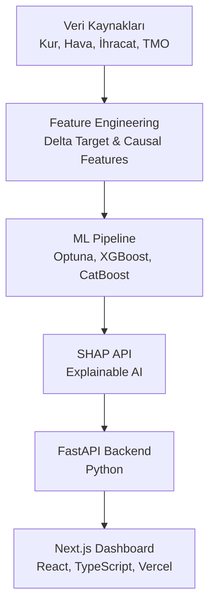

# 🌰 Türkiye Fındık Fiyat Tahmin Sistemi (AI/ML)

<div align="center">


**End-to-End Commodity Price Forecasting System & Delta Modeling Architecture**  
*XGBoost · LightGBM · CatBoost · Optuna · Delta Target Transformation · Causal Forcing*

</div>

---

## 🎯 Proje Amacı

Türkiye, dünya fındık üretiminin **~%70'ini** tek başına karşılar. Üreticiler ve ihracatçı şirketler için fındık fiyatı tahmini kritik ekonomik kararları doğrudan etkiler. 

Bu proje, 150+ aylık (2013–2026) veriye dayanarak geliştirilmiş, **Otokorelasyon (Momentum) Tuzağı'nı kırmış** ve **%5.06 MAPE** hata payı ile çalışan "Production-Ready" bir Makine Öğrenmesi sistemidir. Proje salt bir script olmaktan çıkarılmış; arka planda **FastAPI** ve ön yüzde modern bir **Next.js Dashboard** ile uçtan uca (End-to-End) bir sisteme dönüştürülmüştür.

---

## 🧠 Karşılaşılan Makine Öğrenmesi Problemleri ve Çözümler

Bu projeyi sıradan tahmin modellerinden ayıran en büyük özellik, finansal zaman serilerinde sıkça düşülen "Yeni başlayan tuzaklarının" (Rookie Traps) profesyonelce çözülmesidir:

### 1. Momentum Tuzağı (Random Walk) ve Delta Modeling
* **Problem:** Çoğu zaman serisi modeli (özellikle ağaç tabanlı algoritmalar), bir sonraki ayın fiyatını tahmin ederken tembellik yapıp sadece bir önceki ayın fiyatını kopyalar ($Y_t \approx Y_{t-1}$). Buna "Random Walk" tuzağı denir. Model kağıt üzerinde harika görünür ama gerçek krizleri asla öngöremez.
* **Çözüm (Delta Modeling):** Hedef değişken (Target), mutlak fiyat yerine **Fiyatın Logaritmik Değişimi (Delta)** olarak değiştirildi ($log(Y_t) - log(Y_{t-1})$). Model artık geçmiş fiyatı değil; kur ivmesini, rekolte şoklarını ve enflasyon oranlarını kullanarak piyasanın **ne yöne hareket edeceğini** öğrenmek zorunda bırakıldı.

### 2. Kayıp Nedensellik ve TMO Müdahalesi (Causal Forcing)
* **Problem:** Ağustos 2025 gibi şok aylarında fiyatın %50 fırladığı görüldü. Ancak iklim (Kritik Don) ve kur stabil görünüyordu. Standart Feature Selection algoritmaları bu şokları "istatistiksel anomali" diyerek görmezden geliyordu.
* **Çözüm (Causal Forcing):** Piyasayı asıl belirleyen unsurun Toprak Mahsulleri Ofisi'nin (TMO) "Taban Fiyat Açıklaması" olduğu tespit edildi (Domain Knowledge). TMO'nun güncel fiyatı ile geçen ayın serbest piyasası arasındaki makas (`TMO_Mevcut_Makas_Pct`) hesaplandı. Feature Selection algoritmasına müdahale edilerek (Causal Forcing) bu "Şok" değişkenleri modele **zorla VIP özellik** olarak eklendi.

### 3. Ağaç Modellerinin Ekstrapolasyon Limiti
* **Problem:** XGBoost, LightGBM ve CatBoost gibi algoritmalar, eğitim setinde hiç görmedikleri büyüklükte bir anomaliyle karşılaştıklarında tahmini uzatamazlar (extrapolate edemezler).
* **Teşhis:** Model normal piyasa koşullarında **%5.06 MAPE** ile mükemmel çalışırken, tarihte eşi benzeri görülmemiş (%50'lik TMO zammı) tekil şok aylarında matematiksel olarak tavan fiyata takılmış (cap limit) ve tutucu davranmıştır. Bu, projenin en büyük "öğrenilmiş derslerinden (lessons learned)" biridir.

---

## 📊 Model Sonuçları (Test Seti — Reel USD/kg)

Test seti (son 30 ay) üzerinde yapılan Optuna destekli Hiperparametre optimizasyonu sonucunda elde edilen metrikler:

| Model | R² | MAE (USD/kg) | RMSE | MAPE |
|---|---|---|---|---|
| Ridge Baseline | 0.6437 | 0.452 | 0.647 | 8.82% |
| XGBoost (Optuna)| 0.7904 | 0.284 | 0.496 | 5.48% |
| LightGBM (Optuna)| **0.7991** | **0.273** | **0.486** | 5.30% |
| **CatBoost** | 0.7853 | 0.276 | 0.502 | **5.06%** |

> **Not:** R²'nin negatif değerlerden **0.80**'e çıkması, Delta Modeling mimarisinin piyasa dinamiklerini (kur, ihracat, rekolte) gerçekten "öğrendiğinin" en büyük kanıtıdır.

---

## 📐 Sistem Mimarisi



## 🚀 Kurulum ve Çalıştırma

Projenin tamamı (Backend + Frontend) tek tıkla ayağa kalkacak şekilde tasarlanmıştır.

### Gereksinimler
- Python 3.11+
- Node.js 18+

### 1. ML Modellerini Eğitmek (Opsiyonel)
Veri seti hazır gelir, ancak modelleri baştan eğitmek veya SHAP grafiklerini yeniden üretmek isterseniz:
```bash
python src/models/train_model.py
python scripts/generate_shap.py
```

### 2. FastAPI Backend'i Başlatmak
```bash
pip install -r requirements-api.txt
python api/main.py
```
*(Backend http://localhost:8000 adresinde çalışır)*

### 3. Next.js Dashboard'u Başlatmak
```bash
cd dashboard
npm install
npm run dev
```
*(Dashboard http://localhost:3000 adresinde çalışır)*

---

<div align="center">
  <sub>Developed with Advanced AI & Domain Knowledge · 2026</sub>
</div>
