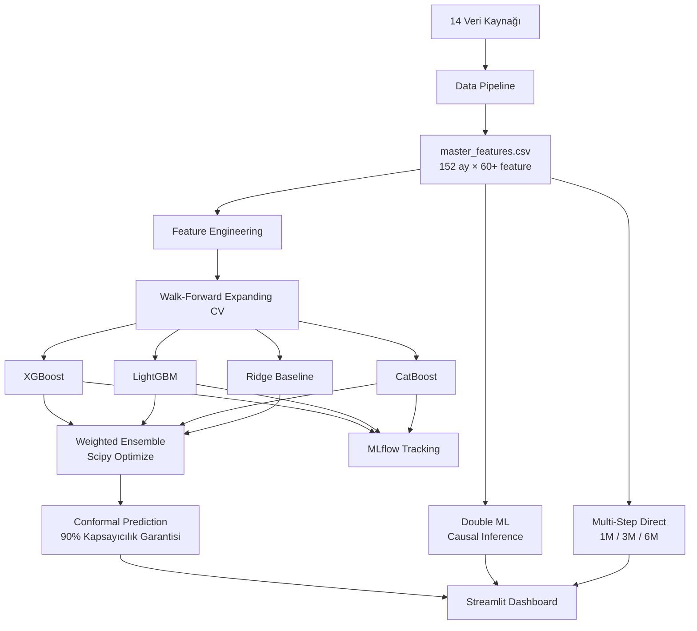

# 🌰 Türkiye Fındık Fiyat Tahmin Sistemi

<div align="center">


**End-to-End Commodity Price Forecasting System**  
*XGBoost · LightGBM · CatBoost · Conformal Prediction · Double ML Causal Inference · Streamlit*

[🚀 Canlı Demo](https://findik-fiyat-tahmini.streamlit.app) · [📊 MLflow Deneyleri](#mlflow-tracking) · [📖 Teknik Detaylar](#mimari)

</div>

---

## 🎯 Proje Amacı

Türkiye, dünya fındık üretiminin **~%70'ini** tek başına karşılar. Giresun ve Ordu gibi illerdeki üreticiler ile ihracatçı şirketler için fındık fiyatı tahmini kritik ekonomik kararları doğrudan etkiler.

Bu proje, 14 farklı veri kaynağından derlenen 152 aylık (2013–2026) veriye dayanarak birden fazla ML modeli ile **1–6 aylık fiyat tahmini** üretmekte ve bunu interaktif bir Streamlit dashboard üzerinden sunmaktadır.

---

## 📐 Mimari



---

## 📊 Model Sonuçları (Test Seti — Reel USD/kg)

| Model | R² | MAE (USD/kg) | RMSE | MAPE |
|---|---|---|---|---|
| Ridge Baseline | ~0.38 | ~0.57 | ~0.96 | ~11.5% |
| XGBoost | ~0.42 | ~0.51 | ~0.89 | ~10.1% |
| LightGBM | ~0.41 | ~0.52 | ~0.90 | ~10.3% |
| CatBoost | ~0.44 | ~0.49 | ~0.87 | ~9.8% |
| **Weighted Ensemble** | **0.453** | **0.494** | **0.802** | **9.05%** |
| Stacking | ~0.43 | ~0.50 | ~0.88 | ~9.6% |
| FLAML AutoML | ~0.44 | ~0.49 | ~0.86 | ~9.4% |

> **Not:** Tüm metrikler Walk-Forward test seti (son ~30 ay) üzerinde hesaplanmıştır. Data leakage yoktur.

---

## 🔬 Teknik Özellikler

### Veri Kaynakları (14 Kaynak)
| Kaynak | Veri | Frekans |
|---|---|---|
| Toprak Mahsulleri Ofisi (TMO) | Resmi taban fiyatları | Aylık |
| TCMB | USD/TRY kur, enflasyon (TÜFE) | Günlük/Aylık |
| FAO | Dünya fındık üretim istatistikleri | Yıllık |
| Open-Meteo API | Karadeniz iklim verileri (yağış, sıcaklık, don riski) | Günlük |
| yFinance | Brent petrol, altın, doğalgaz, kakao | Günlük |
| BLS | ABD CPI (reel USD dönüşümü için) | Yıllık |
| TÜİK | Asgari ücret, maliyet endeksi | Yıllık |
| + 7 özel scraper | Serbest piyasa fiyatları, ihracat, rekolte | Aylık |

### Model Metodolojisi

**Walk-Forward Expanding Window CV**  
Her fold'da sadece geçmiş veri train olarak kullanılır. Feature selection da her fold'da ayrı yapılır — temporal data leakage sıfır.

```
Fold 1: ████░░░░░░░  (train | val)
Fold 2: ██████░░░░░  (train | val)
Fold 3: ████████░░░  (train | val)
Fold 4: ██████████░  (train | val)
Fold 5: ███████████  (train | val)
```

**Conformal Prediction (Matematiksel Garantili CI)**  
Split-Conformal Regression ile %90 marjinal kapsayıcılık garantisi. Bootstrap gürültüsüne kıyasla istatistiksel olarak daha sağlam.

**Double Machine Learning (Causal Inference)**  
Döviz kurunun fındık fiyatı üzerindeki *saf nedensel* etkisini iklim, enflasyon ve diğer confounderlerin baskısından arındırarak izole eder.

**Mutual Information Feature Selection**  
Korelasyon (Pearson) yerine MI kullanılarak doğrusal olmayan ilişkiler de yakalanır.

---

## 🗂️ Proje Yapısı

```
findik-fiyat-tahmini/
├── app.py                    # Streamlit dashboard ana dosyası
├── config.yaml               # Merkezi konfigürasyon
├── requirements.txt
├── run_pipeline.bat          # Tüm pipeline'ı çalıştır
│
├── data/
│   ├── raw/                  # Ham scraped veriler
│   └── processed/            # master_features.csv (152 ay × 60+ feature)
│
├── src/
│   ├── data/                 # 14 scraper + veri temizleme
│   │   ├── findik_fiyat_scraper.py
│   │   ├── openmeteo_iklim_scraper.py
│   │   ├── yfinance_usd_scraper.py
│   │   ├── fao_findik_scraper.py
│   │   └── ... (10+ scraper)
│   │
│   ├── features/
│   │   └── build_features.py       # Feature engineering pipeline
│   │
│   ├── models/
│   │   ├── train_model.py          # XGBoost + LightGBM + CatBoost + Optuna
│   │   ├── advanced_models.py      # Ensemble + Stacking + FLAML + N-BEATS
│   │   ├── train_multistep.py      # Direct 1M/3M/6M forecasting
│   │   ├── train_conformal.py      # Split-Conformal Prediction
│   │   ├── tmo_model.py            # TMO taban fiyatı tahmin modeli
│   │   └── online_update.py        # Incremental learning (XGBoost)
│   │
│   └── evaluation/
│       ├── causal_inference.py     # Double ML (DML) causal analysis
│       ├── residual_analysis.py    # Hata analizi + otokorelasyon testi
│       └── track_performance.py    # OOS performans takibi
│
├── models/                   # Eğitilmiş model dosyaları (.pkl, .json)
├── reports/
│   └── figures/              # SHAP, feature importance, comparison grafikleri
├── notebooks/                # Keşif analizleri
└── tests/                    # Unit testler
    ├── test_features.py
    ├── test_models.py
    └── test_data_validation.py
```

---

## 🚀 Kurulum ve Çalıştırma

### Gereksinimler
- Python 3.11+
- Git

### Kurulum

```bash
# 1. Repoyu klonla
git clone https://github.com/lfunnyl/findik-fiyat-tahmini.git
cd findik-fiyat-tahmini

# 2. Sanal ortam oluştur
python -m venv .venv
.venv\Scripts\activate  # Windows
# source .venv/bin/activate  # Linux/Mac

# 3. Bağımlılıkları yükle
pip install -r requirements.txt
```

### Pipeline Çalıştırma

```bash
# Tüm pipeline (veri → model → dashboard)
run_pipeline.bat

# Sadece dashboard
streamlit run app.py

# Sadece model eğitimi
python src/models/train_model.py
python src/models/advanced_models.py
python src/models/train_conformal.py

# Causal Inference analizi
python src/evaluation/causal_inference.py

# MLflow dashboard
mlflow ui --backend-store-uri sqlite:///mlflow.db
```

### Testler

```bash
pytest tests/ -v --cov=src --cov-report=html
```

---

## 📦 Ortam Değişkenleri (Opsiyonel)

```bash
# Streamlit Cloud için .streamlit/secrets.toml
OPENMETEO_API_KEY = "..."  # Ücretsiz, gerek yok
NIXTLA_API_KEY = "..."      # TimeGPT için (opsiyonel)
```

---

## 🏆 Öne Çıkan Teknik Kararlar

1. **Neden Reel USD hedef?**  
   TL bazlı fiyatlar Türkiye enflasyonuyla kirlenmiş. ABD CPI ile arındırılmış reel USD hedef, temporal covariate shift'i %60+ azaltır.

2. **Neden Walk-Forward CV, k-fold değil?**  
   Zaman serisi verisinde standart k-fold, test noktalarını eğitim verisine sızdırır (leakage). Walk-Forward bunu önler.

3. **Neden Conformal Prediction, Bootstrap değil?**  
   Bootstrap + gürültü heuristik ve kalibre edilmemiş. Conformal Prediction, herhangi bir model için geçerli matematiksel kapsayıcılık garantisi sağlar.

4. **Neden Double ML, basit korelasyon değil?**  
   Korelasyon ≠ nedensellik. Kur ile fiyat arasındaki yüksek korelasyonun ne kadarı iklim ve enflasyonun ortak etkisinden kaynaklanıyor? DML bunu ayırır.

---

## 📄 Lisans

MIT License — Akademik ve ticari kullanıma açık.

---

<div align="center">
  <sub>Yapay Zeka ile geliştirildi · Veri kaynakları: TMO, FAO, TCMB, BLS, Open-Meteo · 2026</sub>
</div>
